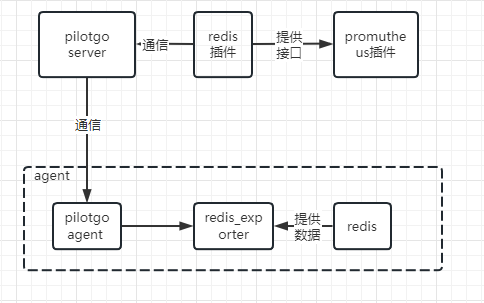
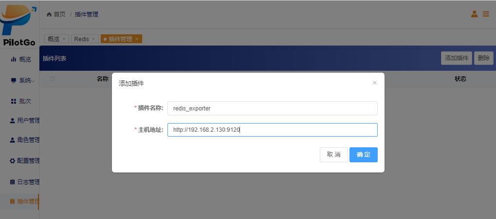
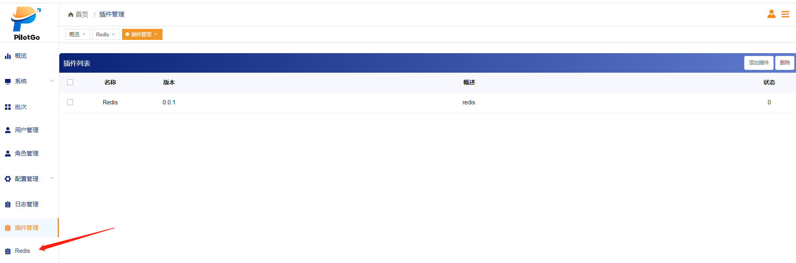

# PilotGo-plugin-redis

#### 介绍
PilotGo-plugin-redis，是一款基于redis_exporter维护和监控redis集群的插件。把通过redis_exporter收集redis的metrics数据（比如uptime、每秒执行命令数、内存利用率等）暴露出来，然后配置Promutheus去抓取redis_exporter暴露出来的数据，实现redis集群的性能监控。

note：PilotGo Redis插件运行依赖PilotGo主平台，如何在PilotGo平台中使用插件，请参考PilotGo平台文档。

#### 软件架构
开发工具：go 1.20  
系统支持：openEuler、麒麟操作系统  
  

#### 安装教程
##### 安装启动部署  
    # Download PilotGo-plugin-redis source code：  
    https://gitee.com/openeuler/PilotGo-plugin-redis.git    
    # Quick build:
    cd PilotGo-plugin-redis/server
    go build -o pilotGo-plugin-redis ./main.go
    # Modify configuration file：
    cp config.yml.templete config.yml
    vim config.yaml
    # Start-up
    nohup ./pilotGo-plugin-redis &
 
##### 二次开发部署  
    # Required before PilotGo application deployment：  
    go >=1.20  
    # Server deployment：  
    1. Rename the config.yaml.templete to config.yaml, and configuration  
    2. cd PilotGo-plugin-redis/server  
    3. go run main.go  

#### 使用说明

1.  使用之前确保PilotGo的服务端处于启动状态，并修改config.yml.templete文件的内容，将其重命名为config.yml。  
2.  启动PilotGo-plugin-redis之后，在PilotGo页面添加插件服务名字和地址。例如：  
3.  显示添加成功之后PilotGo侧边的导航栏回出现插件名字。例如： 

#### 参与贡献

1.  Fork 本仓库
2.  新建 Feat_xxx 分支
3.  提交代码
4.  新建 Pull Request

#### 特技

1.  使用 Readme\_XXX.md 来支持不同的语言，例如 Readme\_en.md, Readme\_zh.md
2.  Gitee 官方博客 [blog.gitee.com](https://blog.gitee.com)
3.  你可以 [https://gitee.com/explore](https://gitee.com/explore) 这个地址来了解 Gitee 上的优秀开源项目
4.  [GVP](https://gitee.com/gvp) 全称是 Gitee 最有价值开源项目，是综合评定出的优秀开源项目
5.  Gitee 官方提供的使用手册 [https://gitee.com/help](https://gitee.com/help)
6.  Gitee 封面人物是一档用来展示 Gitee 会员风采的栏目 [https://gitee.com/gitee-stars/](https://gitee.com/gitee-stars/)
